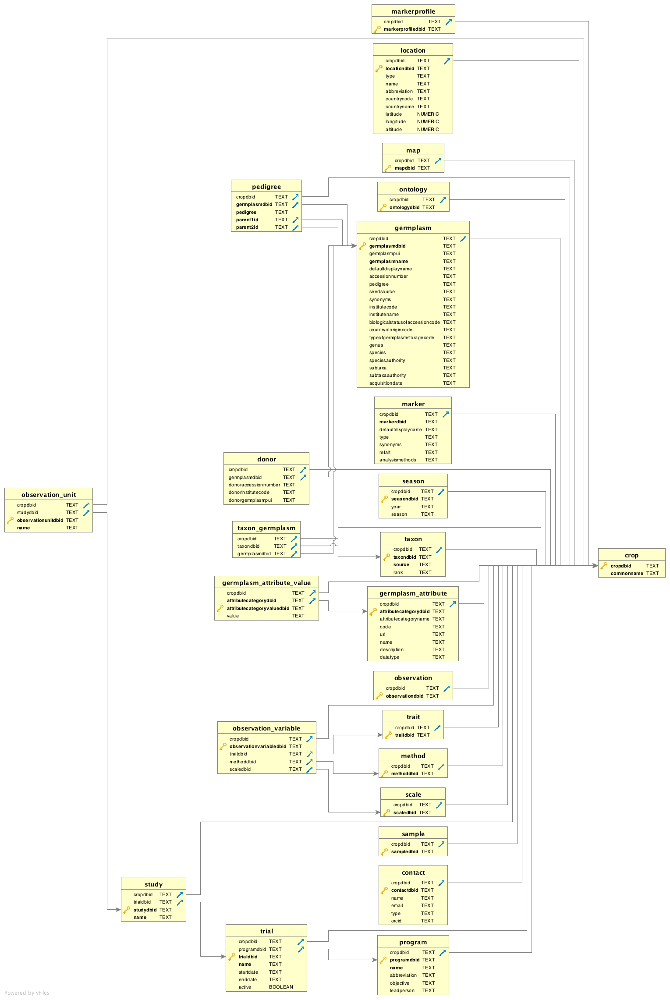

## Work in progress schema (exported with DbVis from `schema.sql`):

Disclaimer:
The data examples are not real and not really coherent.

TODO
- [ ] SQL Schema (see `import-schema.sql` file)
- [ ] CSV data examples for each table (see `data` folder)
- [ ] SQL JSON queries for each BrAPI casll (see `json-query` folder)
